<div align="center">

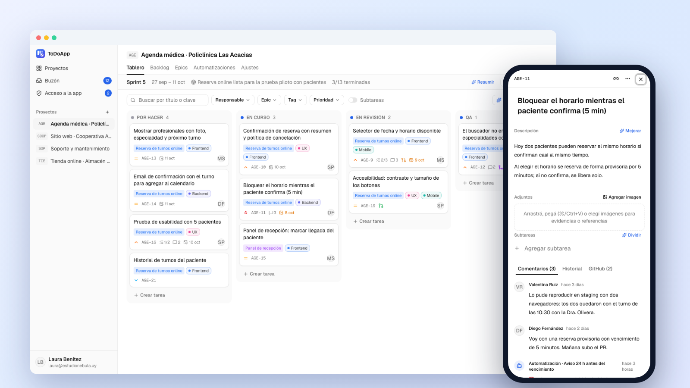

# ToDoApp

### El tablero de tareas para equipos chicos que quieren orden sin la complejidad de Jira.


<br />

<a href="https://matixv23.github.io/ToDoAppDemo/"></a>

</div>

<br />

<p align="center">
  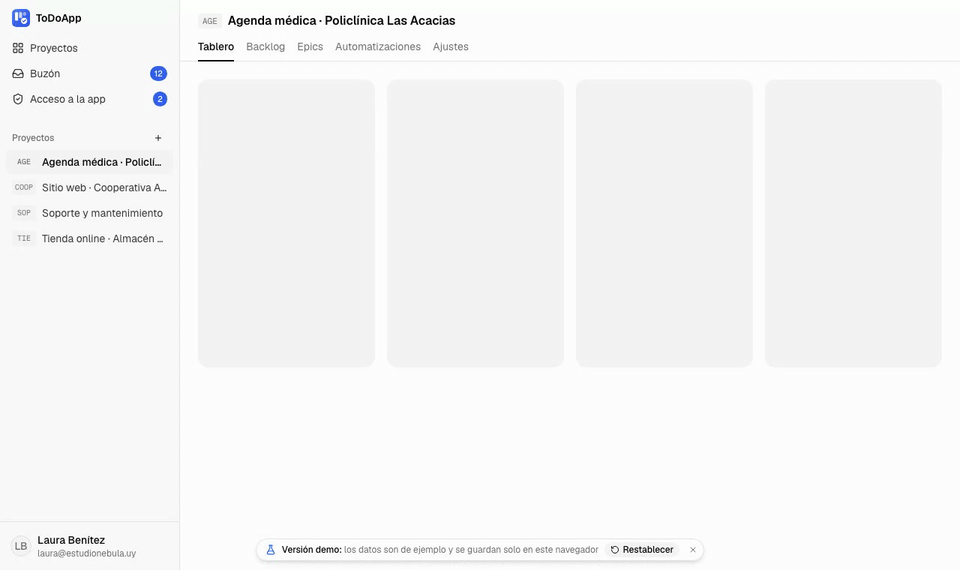
</p>

## Qué resuelve

Cuando un equipo de desarrollo trabaja con varios clientes a la vez, las tareas terminan repartidas entre chats, planillas y mails, y nadie sabe bien qué está en curso. **ToDoApp junta todo en un tablero por proyecto**: qué hay que hacer, quién lo hace, qué rama o PR lo resuelve y qué falta para entregar. Está pensado para estudios de software, freelancers y equipos internos de 2 a 15 personas, que necesitan algo más que una lista pero menos que Jira.

## Lo que vas a poder hacer

<table>
<tr>
<td width="50%" valign="top">

### 🗂️ Ver todo el trabajo de un vistazo
Tablero con columnas a medida, arrastrar y soltar, filtros por responsable, epic, tag o prioridad y búsqueda instantánea. Cada tarjeta muestra el avance de subtareas, la fecha límite y el estado del PR.

</td>
<td width="50%" valign="top">

### 🏃 Sprints cuando los necesitás
Backlog con sprints planificados, sprint activo con su objetivo y cierre que pasa lo pendiente al siguiente. Si el proyecto no usa sprints, funciona como Kanban puro.

</td>
</tr>
<tr>
<td valign="top">

### 🔗 El código conectado a cada tarea
Las ramas, commits y PRs de GitHub que mencionan la clave de la tarea (`AGE-12`) se vinculan solos. Se puede crear la rama desde la tarea y ver si el PR está abierto, en revisión o mergeado.

</td>
<td valign="top">

### ⚙️ Automatizaciones sin programar
Reglas del tipo "cuando se mergea un PR, mover la tarea a QA y asignarla a quien prueba". Cada ejecución queda registrada con el motivo, así siempre sabés por qué pasó algo.

</td>
</tr>
<tr>
<td valign="top">

### ✨ IA que sugiere, vos decidís
Dividir una tarea en subtareas, redactar la descripción, sugerir prioridad y estimación, resumir el sprint o convertir un texto como *"mañana llamar al cliente y el viernes revisar la agenda"* en tareas. Nada se aplica sin tu confirmación.

</td>
<td valign="top">

### 🔐 Cada persona ve lo que tiene que ver
Roles por proyecto (dueño, editor, solo lectura) para sumar a tus clientes a seguir el avance sin que puedan tocar nada. El acceso a la app lo aprueba el administrador.

</td>
</tr>
</table>

<table>
<tr>
<td width="50%">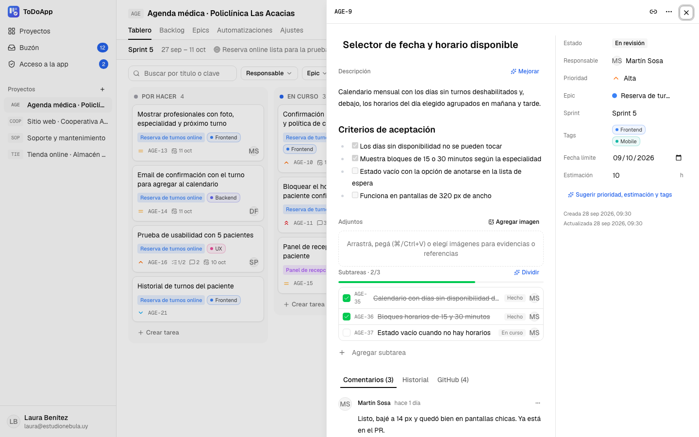</td>
<td width="50%">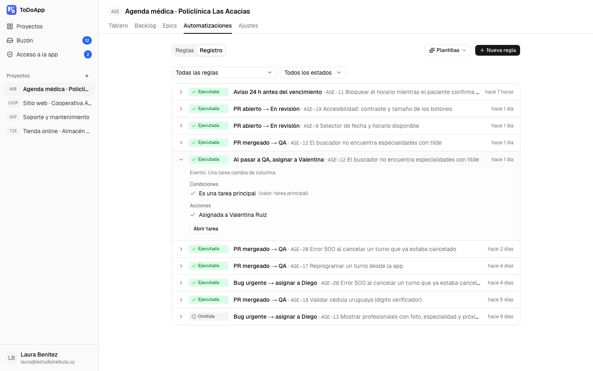</td>
</tr>
<tr>
<td align="center"><sub>Detalle de tarea: descripción, criterios de aceptación, subtareas, adjuntos, comentarios e historial.</sub></td>
<td align="center"><sub>Registro de automatizaciones: qué regla corrió, sobre qué tarea y qué hizo.</sub></td>
</tr>
<tr>
<td width="50%">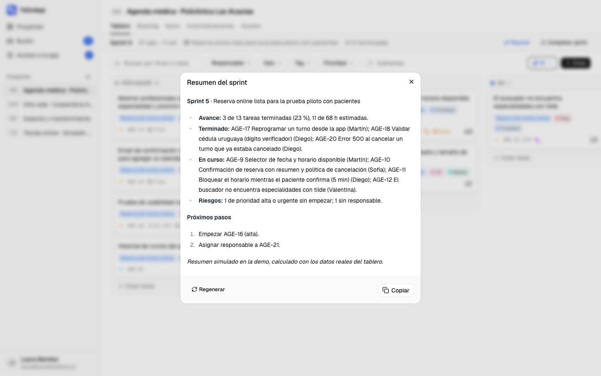</td>
<td width="50%">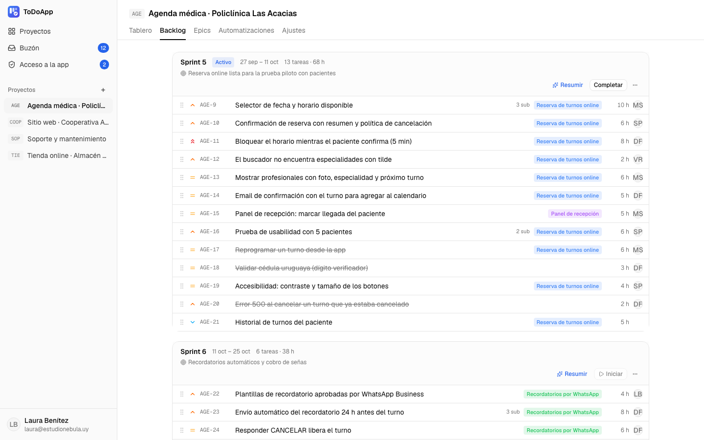</td>
</tr>
<tr>
<td align="center"><sub>Resumen del sprint: avance, riesgos y próximos pasos.</sub></td>
<td align="center"><sub>Backlog: ordenás el trabajo y lo repartís entre sprints arrastrando.</sub></td>
</tr>
</table>

### Y además

- **Agente Claude:** las tareas que marcás con el tag `IA` las toma una rutina de Claude Code, que las implementa y abre el PR. Los cambios chicos se mergean solos en el horario que elijas; los grandes esperan tu revisión. <br /><sub>[Ver la configuración del agente](docs/screenshots/agente-claude.png)</sub>
- **Reportes de usuarios con aprobación:** otras apps pueden cargar tareas por API (por ejemplo, un formulario de reportes). Esas tareas quedan **Por aprobar** hasta que alguien del equipo las lee. <br /><sub>[Ver una tarea por aprobar](docs/screenshots/por-aprobar.png)</sub>
- **Buzón** con invitaciones, asignaciones, comentarios y vencimientos.
- **Adjuntos:** capturas y bocetos en cada tarea, arrastrando o pegando con ⌘/Ctrl+V.
- **Funciona en el celular** con el mismo diseño. <br /><sub>[Ver en celular](docs/screenshots/celular-tablero.png)</sub>

<details>
<summary><b>Más capturas</b></summary>
<br />
<table>
<tr>
<td width="50%">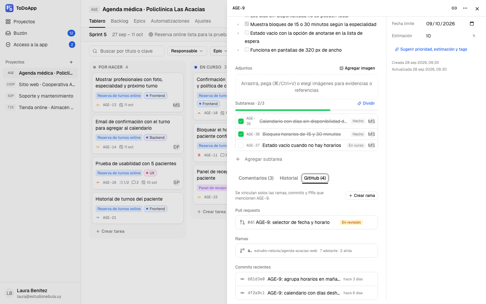<br /><sub>PR, rama y commits vinculados solos a la tarea.</sub></td>
<td width="50%">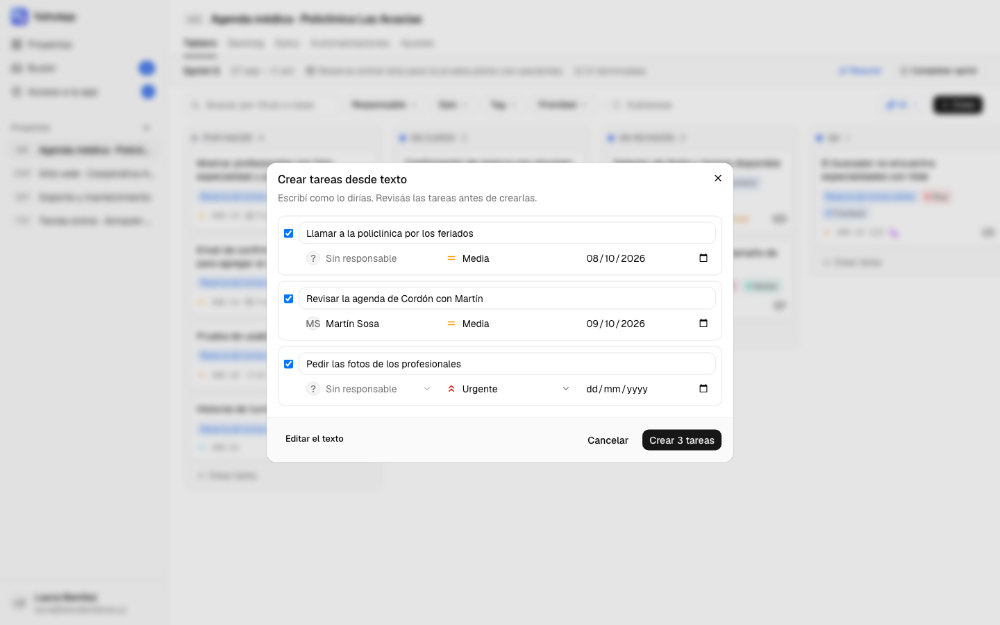<br /><sub>De un texto libre a tareas con fecha y prioridad.</sub></td>
</tr>
<tr>
<td>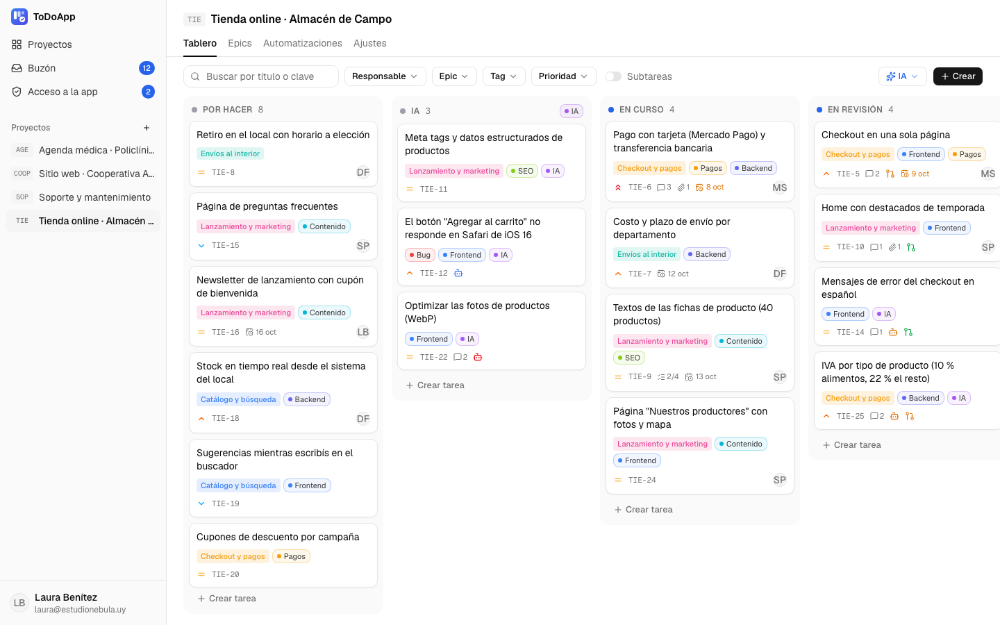<br /><sub>Columna "IA": lo que entra ahí lo toma el agente.</sub></td>
<td>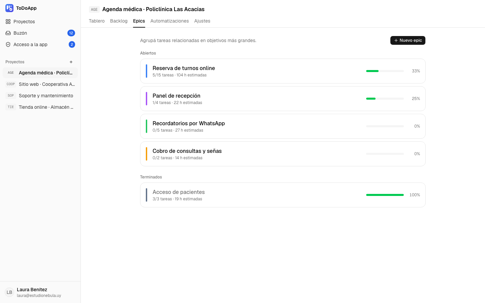<br /><sub>Epics con su avance y horas estimadas.</sub></td>
</tr>
<tr>
<td>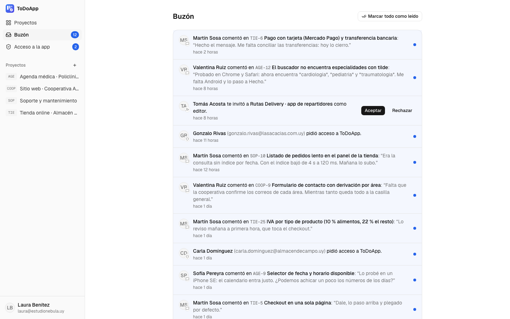<br /><sub>Buzón: invitaciones, comentarios, asignaciones y vencimientos.</sub></td>
<td>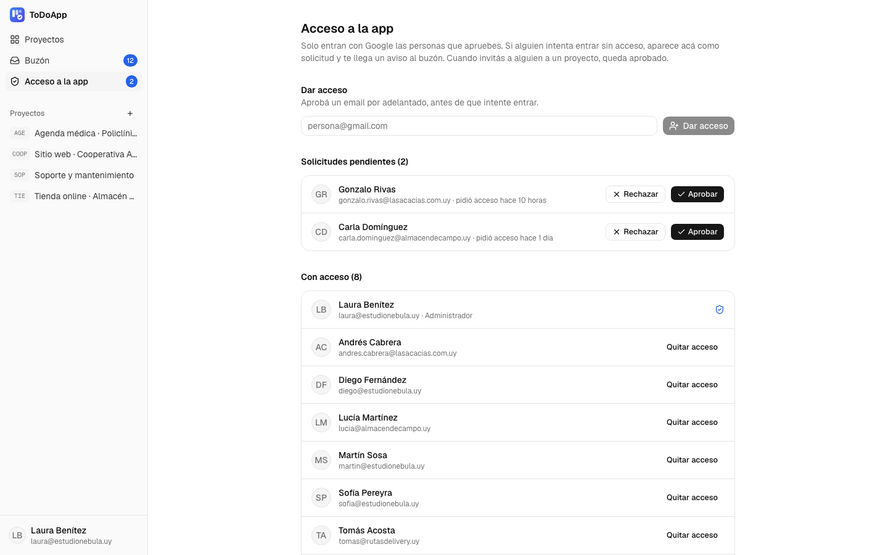<br /><sub>El administrador aprueba quién entra a la app.</sub></td>
</tr>
</table>
</details>

## Probá la demo en 2 minutos

👉 **[matixv23.github.io/ToDoAppDemo](https://matixv23.github.io/ToDoAppDemo/)**

Las credenciales ya están cargadas en la pantalla de ingreso. También podés entrar con un clic por rol:

| Rol | Email | Contraseña | Qué puede hacer |
|---|---|---|---|
| Administradora | `laura@estudionebula.uy` | `demo1234` | Todo: proyectos, miembros, reglas y acceso a la app |
| Editor | `martin@estudionebula.uy` | `demo1234` | Crear, mover y comentar tareas |
| Solo lectura | `andres.cabrera@lasacacias.com.uy` | `demo1234` | Ver el avance de su proyecto (es el cliente) |

**Recorrido sugerido** (entrando como Administradora):

1. Abrí **Agenda médica** y arrastrá una tarjeta de *Por hacer* a *En curso*.
2. Abrí la tarea **AGE-15**, cambiá el estado a **QA** y esperá un segundo: la automatización la asigna a Valentina. En **Automatizaciones → Registro** ves por qué.
3. En el tablero, tocá **IA → Resumir el sprint**.
4. Abrí **AGE-9** y mirá la pestaña **GitHub**: rama, commits y PR vinculados solos.
5. Entrá a **Soporte y mantenimiento** y aprobá un reporte **Por aprobar**.
6. En el **Buzón**, aceptá la invitación de Tomás a otro proyecto.
7. Cerrá sesión y entrá como **Solo lectura**: el mismo tablero, sin poder modificarlo.

> **Es una demo:** los datos son ficticios y todo queda guardado solo en tu navegador. El botón **Restablecer** (abajo, en el aviso de "Versión demo") vuelve todo al estado inicial. El ingreso con Google, GitHub, la IA y los adjuntos están simulados y lo avisan cuando los usás.

## Qué incluye la versión completa

La demo muestra la experiencia completa de uso, pero sin servidor. La versión real suma:

- **Ingreso con Google** y acceso solo por aprobación del administrador.
- **Tiempo real entre personas:** lo que mueve un compañero aparece al instante en tu pantalla.
- **GitHub de verdad:** instalación de la GitHub App, webhooks, creación de ramas en el repo y estado de los PRs y checks.
- **IA con un modelo de lenguaje** (DeepSeek u otro compatible con OpenAI), con límite de uso por persona.
- **API para Claude Code (MCP)** con tokens personales, y la rutina del **agente Claude** que abre y mergea PRs.
- **Avisos programados** de vencimiento y automatizaciones por fecha límite.
- **App instalable** en el celular o la compu (PWA).
- **Base de datos PostgreSQL**, despliegue con Docker en tu propio servidor y tests automatizados de permisos, automatizaciones e integraciones.

## Tecnología


Next.js con tRPC y TanStack Query, interfaz con Tailwind y shadcn/ui, PostgreSQL con Drizzle, login con Better Auth y tiempo real con Server-Sent Events. Esta demo usa el mismo frontend; el servidor está reemplazado por una versión que corre en el navegador.

## Contacto

¿Querés usarlo en tu equipo o que lo veamos juntos?

- **Matías Pérez Frontán**
- ✉️ [contacto@mperezfrontan.com](mailto:contacto@mperezfrontan.com)
- 💼 [LinkedIn](https://www.linkedin.com/in/matias-perez-frontan)
- 🌐 [mperezfrontan.com](https://mperezfrontan.com)

---

<details>
<summary><b>Correr la demo en local</b></summary>

<br />

Requiere Node 22 o superior.

```bash
npm install
npm run dev        # http://localhost:3210/ToDoAppDemo/
```

Para probarla igual que en GitHub Pages: `npm run build && npm run preview` (http://localhost:4173/ToDoAppDemo/). `npm run verify` recorre todas las pantallas con Playwright y falla si hay requests a un servidor o errores en consola; `npm run screenshots` regenera las imágenes de `docs/`.

</details>
